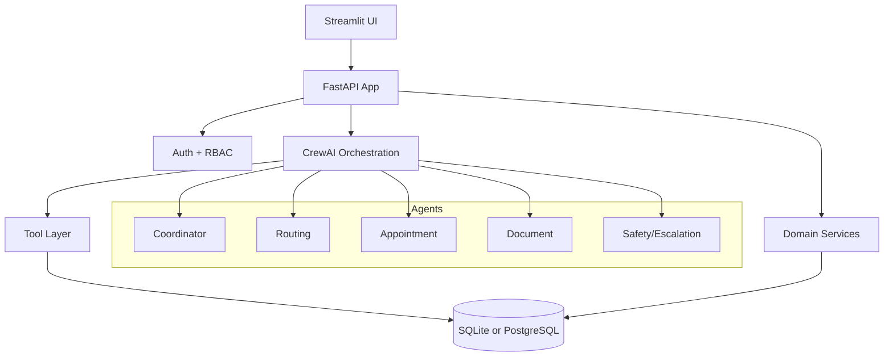

# AgentCare

AgentCare is an AI-powered healthcare administration system that automates non-clinical workflows using FastAPI, CrewAI, SQLAlchemy, and Streamlit.

It supports:
- patient intake and profile handling
- department routing
- appointment booking/reschedule/cancel
- document upload and classification
- reminders and escalation workflows
- audit logging and RBAC-aware API access

## What Was Built

The project includes two main runtime surfaces:

1. Backend API (FastAPI)
- REST endpoints for auth, patients, appointments, documents, reminders, and staff workflows.
- Central business logic in services and CrewAI orchestration for multi-step workflow execution.
- SQLAlchemy persistence for users, profiles, appointments, reminders, escalations, documents, and audit events.

2. Frontend (Streamlit)
- User interface for interacting with the backend workflows.
- Calls backend endpoints for registration/login, profile management, scheduling, and document operations.

## Architecture



### Code Layout

- app/api: FastAPI routers
- app/crews: CrewAI agents, tasks, and orchestration
- app/services: domain-level backend services
- app/tools: agent tools for DB-backed actions
- app/models.py: SQLAlchemy models
- app/schemas.py: Pydantic request/response schemas
- app/database.py: engine/session/base and DB helpers
- app/ui: Streamlit frontend
- data: seed and initialization data

## Requirements

Python:
- 3.11 or 3.12

Install packages:

```bash
pip install -r requirements.txt
```

## Environment Configuration

Create a .env file in the project root:

```env
APP_NAME=AgentCare
DEBUG=true
SECRET_KEY=change-this-secret-key
DATABASE_URL=sqlite:///./agentcare.db

MODEL_PROVIDER=mistral
MISTRAL_API_KEY=your_mistral_key
MISTRAL_MODEL=open-mistral-7b

# Optional if using Groq instead of Mistral
# MODEL_PROVIDER=groq
# GROQ_API_KEY=your_groq_key
# GROQ_MODEL=openai/gpt-oss-120b
```

## How To Run

### Option 1: Start backend with helper script

Windows:

```bat
run.bat
```

Linux/macOS:

```bash
./run.sh
```

This starts FastAPI via [start_api.py](start_api.py).

### Option 2: Start backend manually

```bash
python start_api.py
```

API docs:
- Swagger: http://localhost:8000/docs
- Health: http://localhost:8000/health

### Start Streamlit UI

```bash
streamlit run app/ui/streamlit_app.py
```

## Database

Tables are auto-created at API startup from SQLAlchemy metadata.

For local SQLite, default DB file:
- agentcare.db

## Important Note About OpenAI Error

You may see an OpenAI-related error message (sometimes shown as an embedding/provider error) in logs when using CrewAI/LiteLLM integrations.

For this project, that OpenAI error is not required for your setup and can be ignored if:
- you are using Mistral or Groq as the configured provider
- your configured provider calls are succeeding
- API endpoints continue to function

Why this happens:
- CrewAI routes provider calls through LiteLLM abstractions.
- Some environments print OpenAI-flavored fallback/error text even when OpenAI is not your active provider.
- The implementation includes provider-specific setup for Mistral/Groq, and OpenAI is not mandatory for normal operation.

If requests fail end-to-end, then validate:
- MODEL_PROVIDER value
- corresponding API key in .env
- outbound network access to the selected provider

## Logs and Troubleshooting

Useful log files in project root:
- api-server.log
- api-server-error.log
- streamlit-startup.log
- streamlit-startup-error.log

Quick checks:
1. Confirm dependencies installed from requirements.txt.
2. Confirm Python version is 3.11 or 3.12.
3. Confirm .env contains the selected provider key.
4. Open http://localhost:8000/health and verify database and provider fields.
